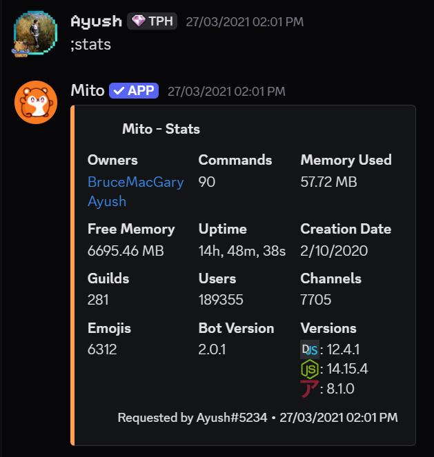
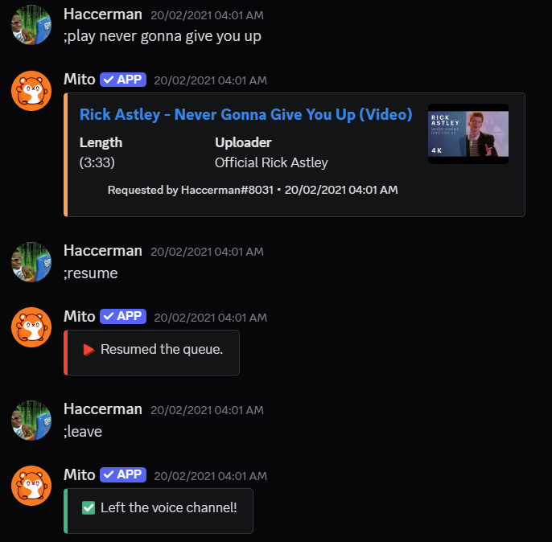
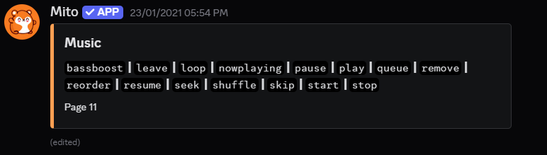
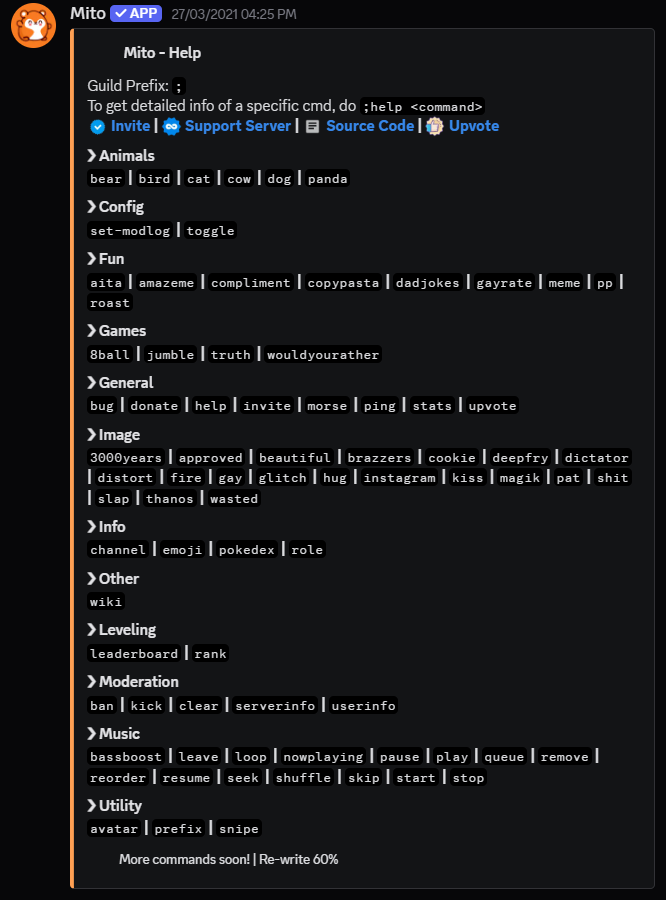

# Mito Discord Bot [Legacy/Archived]

> ⚠️ **Status:** Decommissioned. This project is currently archived as the Discord API v14 update made the codebase legacy.
> 🏆 **Impact:** Scaled to **189,000+ users** across **281 servers**.

  
   
  <em>Real-time metrics from 2021 showing server count (281) and active user base (189,355).</em>

## 📖 About
Mito was a high-performance, multipurpose Discord bot designed to simplify server management and entertainment. It was built to solve the lack of reliable, free music and moderation tools available at the time.

### Key Features
* **🎶 High-Fidelity Audio:** Powered by **Lavalink** nodes to handle concurrent high-quality streams without lag.
* **📊 Leveling System:** Gamified XP tracking where users earn experience per message. Integrated with a **Rank API** to generate dynamic, graphical rank cards on the fly using a custom math algorithm (`XP = 5 * lvl^2 + 50 * lvl + 100`).
* **🛡️ Moderation:** Automated tools to kick/ban and manage spam.
* **📈 Server Analytics:** Real-time insights into server growth and activity.

## 🖼️ Gallery & Interface

| **Music System & Queue** | **Help Menu** |
| :---: | :---: |
|    |  |
| *Seamless playback and queue management* | *Dynamic command handling* |

## ⚙️ Technical Architecture
*The system was engineered for scalability and type safety:*

* **Language:** Written completely in **TypeScript** for strict type checking and maintainability.
* **Framework:** Built on **Node.js (v14)** using `discord.js` (v12) and `discord-akairo` for modular command handling.
* **Audio Engine:** Utilized **Lavalink** nodes (Java-based audio sending) to offload heavy DSP tasks from the main process.
* **Data Persistence:** Used **MongoDB** (via Mongoose) for persistent user configurations and playlist storage.
* **External APIs:** Integrated `amethyste-api` for image manipulation and `moment.js` for time parsing.

---

### 🛑 Maintenance & Legacy Notice
**Current Status (2026):**
As of January 2026, the current version of the Discord library is **discord.js v14.25.1**. This repository runs on **v12** and is therefore incompatible with the current Discord Gateway v10.

**Why is it not updated?**
This project was developed and maintained by a team of students (aged 13-14) in 2020-2021.
* We relied on **Heroku's free tier** (Hobby Dynos) for hosting, which has since been discontinued.
* As students with limited financial resources at the time, we could not sustain the server costs required to support 189,000+ users once the free tiers were removed.
* Consequently, the project was archived to focus on academic pursuits and modern web development stacks.

---

### 🛠️ Legacy Setup Instructions
*(These instructions are preserved for historical reference only)*

Click to view original documentation

### Prerequisites
- Node.js v14.x
- MongoDB Cluster
- Lavalink Server (v2.10+)

### Installation
1. Clone the repo
2. `npm install`
3. Configure `.env` with your token and Lavalink nodes
4. `npm run build`
5. `npm run start`

## 🏅 Certifications & Recognition
* **✅ Official Discord Verification:** Achieved "Verified Bot" status. This required a manual security audit and code review by Discord officials to approve **Privileged Gateway Intents** (Presence & Member access) for mass usage.
* **⭐ Community Listed:** Featured on top Discord bot directories due to high uptime and user engagement.

### 🗳️ Historical Rankings & Listings
*At its peak, Mito was top-ranked on major bot directories. Top.gg (formerly Discord Bot List) is the largest index for Discord bots.*

  
   
  
  
   
  <em>*Note: Because the bot is currently offline/decommissioned, these live widgets may show "Offline" status or broken images.*</em>

